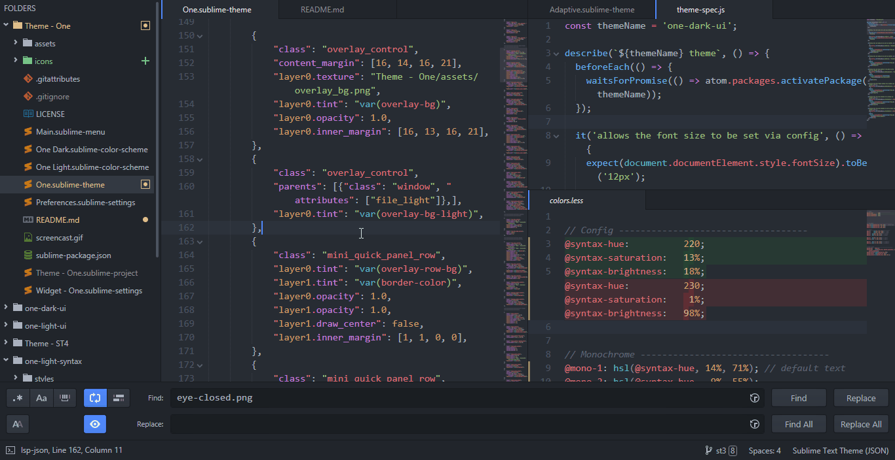

# One Theme

A port of Atom's One Dark and One Light UI and Syntax Themes.

The package includes two color schemes `One Dark` and `One Light` in addition to an adaptive Theme.
Make sure to disable or remove any other color scheme with the same name, namely https://packagecontrol.io/packages/One%20Dark%20Color%20Scheme.

## Installation

[Package Control](https://packagecontrol.io/docs/usage)

## Preferences

Open `Preferences > Package Settings > Theme - One` from the menu.
Also supports [LSP-json](https://packagecontrol.io/packages/LSP-json) autocompletion and validation.
