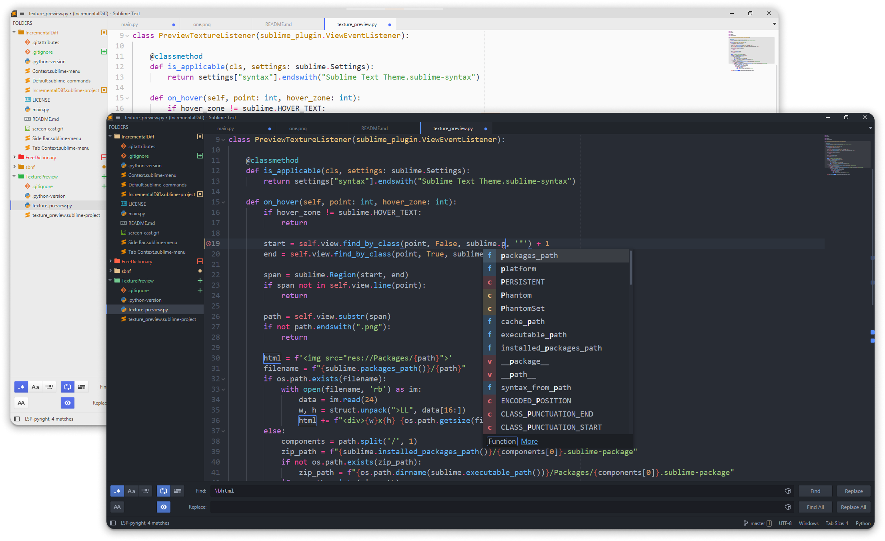

# One Theme
 

🎨 A port of Atom's One Dark and One Light UI and Syntax Themes for ST4 and ST3.2+ ⚡.



The package includes two color schemes `One Dark` and `One Light` in addition to an adaptive Theme.
Make sure to disable or remove any other color scheme with the same name, namely https://packagecontrol.io/packages/One%20Dark%20Color%20Scheme.

## Installation

[Package Control](https://packagecontrol.io/docs/usage)

## Preferences

Preferences for the closest look to atom, add to your user settings (if you wish).

```json
{
	"always_show_minimap_viewport": true,
	"animation_enabled": false,
	"caret_extra_bottom": 2,
	"caret_extra_top": 1,
	"caret_style": "blink",
	"enable_tab_scrolling": false,
	"highlight_line": true,
	"highlight_modified_tabs": true,
	"indent_guide_options": [
		"draw_normal",
		"solid"
	],
	"line_padding_bottom": 2,
	"line_padding_top": 1,
	"margin": 0,

	// ST4-specific
	"highlight_gutter": false,
	"show_scroll_tabs_buttons": false,
	"show_tabs_dropdown_button": false,
	"show_new_tab_button": false,
}
```

ST4 introduced auto dark/light mode switching,
run `UI: Select Theme` and `UI: Select Color Scheme`, choose `auto` and proceed.
Or add these to your user settings:

```json
{
	"theme": "auto",
	"dark_theme": "One.sublime-theme",
	"light_theme": "One.sublime-theme",

	"color_scheme": "auto",
	"dark_color_scheme": "One Dark.sublime-color-scheme",
	"light_color_scheme": "One Light.sublime-color-scheme",
}
```

## Customization

For ST4, Run `UI: Customize Theme` from the command palette,
for ST3, navigate to `Preferences > Package Settings > Theme - One > Customize`.
See https://www.sublimetext.com/docs/themes.html#customization.

Here's a sample override:

```json
{
	"variables": {
		// darker borders with medium-dark color schemes
		"border-color": "color(var(ui-bg) l(- 8%))",
	},

	"rules": [
		// Highlight the top border of the focused tab instead of the left one
		{
			"class": "tab_control",
			"layer2.inner_margin": [0, 2, 0, 0],
		},
		// ST4: Match the color of the tab connector to that of the tab
		{
			"class": "tab_connector",
			"tint_index": 0,
			"layer0.opacity": 0.0,
		},
		// Hide sidebar's vcs status icons
		{
			"class": "vcs_status_badge",
			"layer0.opacity": 0.0,
		},
		// Show panel's close button
		{
			"class": "panel_close_button",
			"content_margin": 8,
			"layer0.opacity": 1.0
		},
	]
}
```

## Credits

https://github.com/andresmichel/one-dark-theme was helpful for me to create this theme.